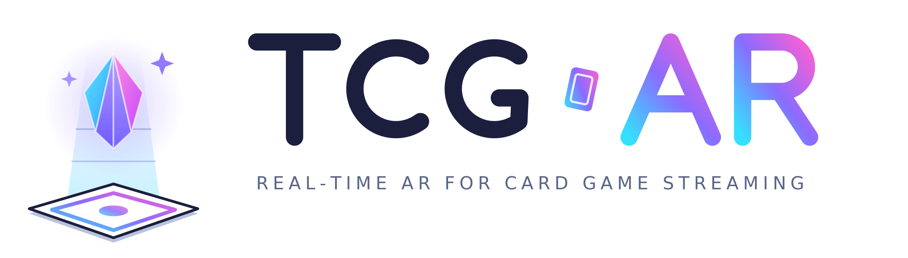
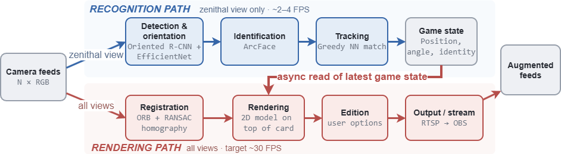
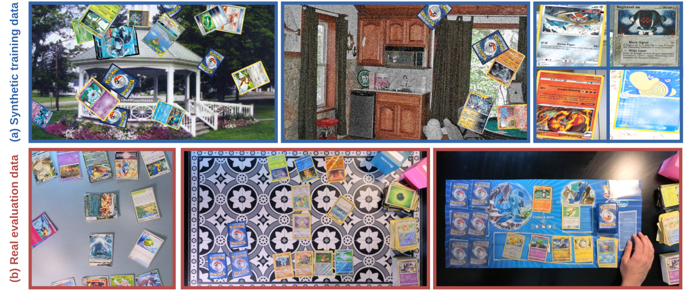
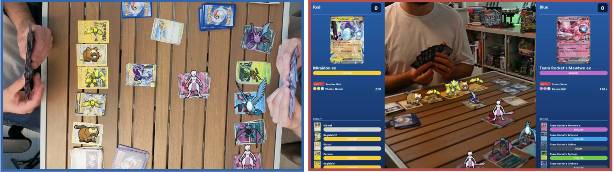
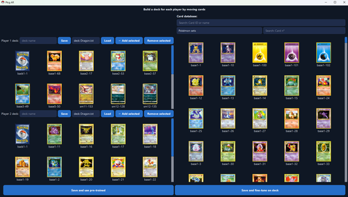
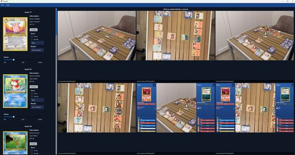

<p align="center">
  <picture>
    <source media="(prefers-color-scheme: dark)" srcset="docs/figures/tcg-ar_logo_dark.png">
    
  </picture>
</p>

<p align="center"><b>2026</b> &nbsp;|&nbsp; <a href="https://arxiv.org/abs/2607.02090">Paper</a> &nbsp;|&nbsp; <a href="https://youtu.be/Gn59g8xKbtk">Game demo ▶</a> &nbsp;|&nbsp; <a href="https://youtu.be/s2vnQ3FTKEw">Interface demo ▶</a></p>


TCG-AR detects, orients, and identifies Pokémon trading cards from ordinary RGB cameras,
renders a virtual creature model onto each card across every camera view, and streams the
augmented feeds to broadcasting software such as OBS, all in real time, with no markers,
chips, or instrumented surfaces.

> **Platform.** Developed and tested on **Windows 10/11** with an **NVIDIA GPU**.
> Two GPU generations are supported, see [Installation](#1-installation-windows) for the
> matching PyTorch / CUDA stack (11.8 for Ampere/Turing, 13.2 for Blackwell).
> Linux and macOS should work but are **not tested**. All commands below are written for
> **Windows PowerShell**; Linux/macOS users substitute `$env:VAR="value"` with `export VAR=value`.

> Research code accompanying the paper. Provided **as is, without any warranty**
> (see [License](#license)).

---

## Demo

| Game demo | Interface demo |
|:---:|:---:|
| [](https://youtu.be/Gn59g8xKbtk) | [](https://youtu.be/s2vnQ3FTKEw) |

---

## Table of contents
- [Features](#features)
- [Pipeline](#pipeline)
- [Datasets](#datasets)
- [Results](#results)
- [Application](#application)
- [Easy installation (Windows installer)](#easy-installation-windows-installer)
- [Repository layout](#repository-layout)
- [1. Installation (Windows)](#1-installation-windows)
- [2. Get the models and data](#2-get-the-models-and-data)
- [3. Choose your path](#3-choose-your-path)
  - [A. Run the pipeline (inference only)](#a-run-the-pipeline-inference-only)
  - [B. Retrain everything](#b-retrain-everything)
  - [C. Update the card database with new cards (no retraining)](#c-update-the-card-database-with-new-cards-no-retraining)
- [4. Reproduce the paper](#4-reproduce-the-paper)
- [Embedding cache](#embedding-cache)
- [Configuration](#configuration)
- [License](#license)
- [Citation](#citation)

---

## Features
- **Markerless:** ordinary RGB cameras, no chips, markers or instrumented surfaces.
- **Multi-view:** one zenithal recognition view + any number of auxiliary views, registered by homography.
- **Real-time:** a fast rendering path (≈30 FPS) decoupled from a slower recognition path.
- **Broadcast overlay:** TV-style composite with per-player active/bench cards, HP, status and attacks.
- **OBS output:** every selected view is published as an RTSP stream (raw / augmented / broadcast).
- **Two-player deck selection:** build, name, save and reload a deck per player; identification is restricted to the union.
- **Open-set identification** (metric learning): new cards are recognised by adding their reference image, **no retraining required**.

---

## Pipeline



TCG-AR runs two concurrent paths.
The **recognition path** operates on one zenithal (top-down) view: an Oriented R-CNN detects
and crops each card, EfficientNet-B0 resolves the 180-degree orientation ambiguity, and an
ArcFace metric-learning head identifies each card by nearest-neighbour lookup in a reference
embedding database built from the full Pokémon TCG card catalogue.
The **rendering path** operates on all views: it registers auxiliary cameras to the zenithal
reference by planar homography, composites an animated sprite onto each recognised card, and
encodes the result as an RTSP stream for OBS or any RTSP-capable receiver.
The two paths run asynchronously, so the display stays fluid even when recognition is slower
than the target frame rate.

---

## Datasets



Training data is generated **fully automatically** from a reference set of card images,
with no manual labelling required.
Synthetic detection scenes composite card images onto background textures; orientation and
identification crops are produced with varied lighting, colour, and noise augmentation.
A manually annotated **real evaluation set** (captured under varied lighting and board
conditions) is used only for evaluation, measuring the synthetic-to-real transfer gap.
The card database covers **20,360 Pokémon TCG cards** sourced from the Pokémon TCG API.

---

## Results



Quantitative highlights on the real evaluation set (14-card board, GPU inference):

| Stage | Model | Metric | Real | Deck-restricted | Speed |
|:---|:---|:---|:---:|:---:|:---:|
| Detection | Oriented R-CNN | mAP / Recall | 0.90 / 0.90 | — | 14 FPS |
| Orientation | EfficientNet-B0 | Accuracy | 98.7 % | — | 119 FPS |
| Identification | ArcFace | Top-1 / Top-5 | 85.1 / 96.2 % | 96.4 / 99.2 % | 55 FPS |

Rendering: 3 simultaneous augmented 1080p views at 30 FPS (per-view cost: 8.5 ms), or 17 raw views.
Full results and method comparisons are in Tables 2 and 3 of the paper.

---

## Application

| Deck-building screen | Broadcast side panel |
|:---:|:---:|
|  |  |

The deck-building screen lets each player select their deck from the full card database, with
live camera scanning to auto-detect cards on the board.
The broadcast side panel displays per-player active and benched cards with HP, status, and
attack information for spectators.

---

## Easy installation (Windows installer)

**No Python, no conda, no command line.** If you just want to *use* TCG-AR,
download **`TCG-AR-Setup-<version>.exe`** from the
[Releases page](https://github.com/ULiege-VIULab/tcg-ar/releases) and
double-click it. (If Windows SmartScreen shows "Windows protected your PC",
click *More info* → *Run anyway* — the installer is not code-signed.)

**What you need:** Windows 10/11, an NVIDIA GPU (RTX 20-series or newer), an
internet connection, and a free Pokémon TCG API key — sign up at
<https://dev.pokemontcg.io> and copy the key; the installer asks for it.

**What the installer does, entirely inside its own window:**
1. Detects your GPU generation and picks the matching software stack
   automatically (you can override it).
2. Lets you choose the components: AI models (required), the card database
   (~20,000 cards, several GB — this is where the API key is used), and the
   pre-computed embeddings (recommended).
3. Copies the app, then downloads and configures everything with progress
   bars and a live log — no console windows. The big download is 3–8 GB;
   the card database can take 1–3 hours. If anything fails (e.g. a network
   hiccup), the error is shown right in the installer with a **Retry**
   button, and every step resumes where it stopped.

**After installation** you get three Start Menu entries:
- **TCG-AR** — launches the app (appears once setup completed successfully;
  on first launch Windows Firewall asks once — click *Allow access*).
- **TCG-AR – Update card database** — fetches new cards after set releases.
- **TCG-AR Setup (repair)** — resumes/repairs an interrupted setup.

**When new card sets release:** run the installer again and pick **"Update
the card database"** on the first page (or use the Start Menu shortcut).
Only the missing cards, sprites and embeddings are fetched — **no model
retraining is ever needed** ([why](#c-update-the-card-database-with-new-cards-no-retraining)).

**Updating TCG-AR itself:** download the newer setup exe and install over
the old one — your card database, models and settings are preserved.

**Uninstalling:** Windows Settings → Apps → TCG-AR (it asks whether to keep
the downloaded data for a future reinstall).

Everything below this point is for **developers** who want to set up the
environment manually, retrain the models, or reproduce the paper.

---

## Repository layout
```
core/          # shared library: config, databases, transforms, models, training utils
installation/  # build the databases + generate the synthetic datasets
training/      # train detection / orientation / identification
evaluation/    # evaluate on the synthetic and real test sets
inference/     # the live real-time app (GUI, capture, render, RTSP, recognition)
scripts/       # download_assets.py (fetch the large pre-built artifacts)
assets/        # data + model weights (see "Get the models and data")
docs/DATA.md   # detailed description of every asset and how to obtain it
```
All commands are run **from the repository root as modules** (`python -m package.module`).
Open **PowerShell** in the repository folder before running them.

---

## 1. Installation (Windows)

> **Manual / developer setup.** End users should use the
> [Windows installer](#easy-installation-windows-installer) instead — it
> needs no command line and manages its own Python environment.

Pick the option that matches your GPU. Both use conda
([Miniconda](https://docs.conda.io/en/latest/miniconda.html)).

### Option A: Ampere / Turing and earlier (CUDA 11.8, e.g. RTX 3090 / 2080 Ti)

Python 3.11, mmrotate 0.3.x / mmdet 2.x / mmcv-full 1.7.x stack.

```powershell
conda create -n tcgar python=3.11
conda activate tcgar

# PyTorch (CUDA 11.8) — requires an NVIDIA GPU + recent driver
pip install torch==2.0.1 torchvision==0.15.2 torchaudio==2.0.2 `
    --index-url https://download.pytorch.org/whl/cu118

# Oriented-detector stack (mmrotate 0.x)
pip install openmim "numpy==1.26.4"
mim install "mmcv-full==1.7.2"
mim install "mmdet==2.28.2"
pip install "mmrotate==0.3.4"

# Remaining pure-Python dependencies
pip install -r requirements.txt
```
(In PowerShell the backtick `` ` `` continues a command onto the next line; you can also put
the whole `pip install torch ...` command on one line.)

### Option B: Blackwell (CUDA 13.2, RTX 5080 / 5090)

Python 3.14, mmrotate ≥1.0 / mmdet ≥3.0 / mmcv ≥2.0 / mmengine stack.
Requires driver ≥ 576 (sm_120 support).

```powershell
conda create -n tcgar-py314 python=3.14
conda activate tcgar-py314

# 1. PyTorch (CUDA 13.2)
pip install torch==2.12.1+cu132 torchvision --index-url https://download.pytorch.org/whl/cu132

# 2. OpenMMLab 2.x stack (mmengine must come before mmcv/mmdet/mmrotate)
pip install openmim mmengine
mim install "mmcv>=2.0.0" "mmdet>=3.0.0" "mmrotate>=1.0.0"

# 3. Remaining dependencies
pip install -r requirements.txt

# 4. Apply compatibility patches (Python 3.14 + mmrotate 1.x — idempotent, safe to re-run)
python -m scripts.patch_mmlibs
```

After install, copy `settings.example.yaml` to `settings.yaml` and fill in the absolute
path to `mediamtx.exe`.

> **Warning:** do **not** run `conda install -c conda-forge ffmpeg`, it overwrites shared
> DLLs (`liblzma`, Qt) and breaks PySide6. If you need `ffplay` for stream inspection,
> install it system-wide via `winget install Gyan.FFmpeg` instead.

**For live streaming output** you additionally need OBS to view the streams. The RTSP
server (MediaMTX) is managed automatically: `mediamtx-py` downloads its binary on first
run and starts/stops it for you; no manual configuration is required.

3D rendering (`inference/rendering_3d.py`) is optional and disabled.

---

## 2. Get the models and data
`assets/` ships only what cannot be downloaded or generated: the **real evaluation set**
annotations, the card back, `no_pokemon.png`, `wrong_scan_cards.json`, and example decks.
Everything else is fetched or built. See **[docs/DATA.md](docs/DATA.md)** for the full map.

**a) Pre-built models + real evaluation set** (large; hosted on Google Drive):
```powershell
python -m scripts.download_assets            # models + real eval set
python -m scripts.download_assets --list     # see what would be fetched, where
python -m scripts.download_assets --only models
```
This places the Oriented R-CNN, EfficientNet-B0 and ArcFace weights under
`assets/AI models/...`, and the real evaluation images under `assets/AI database/real/`.

**b) Card databases** (card images, sprites, JSON metadata) are built from the Pokémon TCG
API. Get a free key at <https://dev.pokemontcg.io>, set it, then build:
```powershell
setx POKEMON_TCG_API_KEY your-key            # persists for NEW shells; reopen PowerShell after
# or, for the current shell only:  $env:POKEMON_TCG_API_KEY = "your-key"
python -m installation.install --metadata --cards --sprites
```

**c) Background textures** for synthetic generation come from a separate download link
(provided by the authors); `download_assets.py` can fetch them into
`assets/AI database/background/`. They are only needed to **regenerate** the synthetic
detection/orientation datasets.

---

## 3. Choose your path

### A. Run the pipeline (inference only)
Use the shipped models; no training, no synthetic data. Needs a webcam.
```powershell
# 1) deps (section 1) and pre-built models (section 2a)
python -m scripts.download_assets --only models

# 2) build the card databases the renderer/recognizer need (section 2b)
$env:POKEMON_TCG_API_KEY = "your-key"
python -m installation.install --metadata --cards --sprites

# 3) optional but recommended: pre-compute embeddings so first start-up is instant
python -m installation.install --embeddings

# 4) launch the app (MediaMTX starts automatically on first run)
python -m inference.main
```
The app window shows the live camera feeds with the AR overlays. Streams are published at
30 fps on `rtsp://localhost:8554/ptcgAR/<id>`. Stream IDs: raw = `0…N-1`,
AR-composited = `N…2N-1`, broadcast overlay = `2N…3N-1` (where N = number of cameras;
the zenithal view's broadcast stream is at `zenith_index + 2N`).

**OBS configuration for low latency**, add a *Media Source* (not VLC source):
- Input: `rtsp://localhost:8554/ptcgAR/<id>`
- Network Buffering: **0 MB** (drag the slider all the way left)
- Use Hardware Decoding When Available: checked

To smoke-test recognition without cameras, run the recognition pipe on a recorded video:
```powershell
python -m inference.identification_pipe path\to\video.mp4
```

### B. Retrain everything
```powershell
$env:POKEMON_TCG_API_KEY = "your-key"

# 1) databases (metadata + card images + sprites)
python -m installation.install --metadata --cards --sprites

# 2) background textures (section 2c), then generate the synthetic datasets
python -m scripts.download_assets --only background
python -m installation.install --detection-dataset --orientation-dataset --identification-dataset

# 3) train (weights are written under assets/AI models/...)
python -m training.train_detection
python -m training.train_orientation                       # --arch resnet18 | mobilenet_v3_small | shufflenet_v2_x1_0
python -m training.train_identification --method arcface    # or --method triplet

# 4) evaluate
python -m evaluation.eval_detection      --dataset synthetic     # and --dataset real, --fps
python -m evaluation.eval_orientation    --dataset real
python -m evaluation.eval_identification --method arcface --dataset real                  # open set
python -m evaluation.eval_identification --method arcface --dataset real --deck-restricted
```
Full hyper-parameters are in the paper's supplementary material (also summarised in
[docs/DATA.md](docs/DATA.md)). The deployed pipeline uses Oriented R-CNN + EfficientNet-B0
+ ArcFace; training overwrites those weights.

### C. Update the card database with new cards (no retraining)
When new sets are released, refresh the databases: **no model retraining is required**.
Identification is open-set metric learning (a card is matched by nearest neighbour to its
reference image, so adding the image adds the card), and detection/orientation are
class-agnostic (card vs. background, upright vs. flipped).
```powershell
$env:POKEMON_TCG_API_KEY = "your-key"
python -m installation.install --metadata --cards          # refresh JSONs + card images
# optional: re-flag wrongly-scanned (card-back) reference images
python -m installation.find_wrong_scans --threshold 0.85
```
The next run of the pipeline picks up the new cards automatically.

---

## 4. Reproduce the paper
The detection and orientation **method comparisons** retrain alternative architectures on
the same data and schedule:
```powershell
python -m training.make_detection_configs        # generate the 4 alternative detector configs
python -m training.train_detection --config "assets/AI models/Detection model/configs/rotated_fcos.py" `
                                    --work-dir work_dirs/rotated_fcos --no-integrate
python -m evaluation.eval_detection --config <cfg> --checkpoint work_dirs/<m>/latest.pth --dataset real
python -m training.train_orientation --arch resnet18        # + mobilenet_v3_small, shufflenet_v2_x1_0
python -m evaluation.eval_orientation --arch resnet18 --dataset real
```
The identification error analysis (composite images of every ArcFace error) is produced by:
```powershell
python -m evaluation.analyze_identification_errors
```

Lightweight headless tests live in `tests/`. Run them from the repository root:
```powershell
python -m tests.sprite_render_check
$env:QT_QPA_PLATFORM = "offscreen"; python -m tests.deck_two_player_check    # offscreen Qt
```

---

## Embedding cache

Card embeddings (ArcFace / Triplet feature vectors) are cached to disk at
`assets/embedding_cache/` the first time they are computed. This turns a
2-3 minute embedding step into a ~30-second load on subsequent runs.

Pre-compute the cache during installation so the first app start-up is instant:
```powershell
python -m installation.install --embeddings
```

The cache is invalidated automatically whenever the model weights or the active
card list change: cache files are keyed by a SHA-256 hash of both, so stale
files are simply ignored (they never cause incorrect results).

To clear the cache:
```powershell
python -m scripts.clear_embedding_cache
# Or use the "Clear embedding cache" button in the deck-building screen.
```

---

## Configuration
Set through environment variables (read by `core/config.py`). In PowerShell use
`$env:NAME = "value"` for the current shell, or `setx NAME value` to persist for new shells
(on Linux/macOS use `export NAME=value`):
- `PTCG_ASSETS_ROOT`: path to the `assets` tree (defaults to `.\assets` inside the repo).
- `PTCG_IDENTIFICATION_METHOD`: `arcface` (default) or `triplet`.
- `POKEMON_TCG_API_KEY`: free key from <https://dev.pokemontcg.io>, only for building databases.
- `PTCG_PROFILE`: set to `1` to print per-stage timing / stream drop-rate diagnostics during inference.

---

## License
Released under the **GNU General Public License v3.0** (see [LICENSE](LICENSE)). The code is
provided **without any warranty**, to the extent permitted by applicable law.

---

## Citation
If you use this code, models, or data in your research, please cite:

**BibTeX / LaTeX**
```bibtex
@misc{Cioppa2026TCGAR,
  title         = {TCG-AR: Real-Time Multi-View Augmented Reality for Trading Card Game Streaming},
  author        = {Cioppa, Anthony and Verdonck, Antoine and Henry, Maxim
                   and Van Droogenbroeck, Marc and La Rocca, Rapha\"{e}l},
  year          = {2026},
  eprint        = {2607.02090},
  archivePrefix = {arXiv},
  primaryClass  = {cs.CV},
  url           = {https://arxiv.org/abs/2607.02090},
}
```

**APA**
```
Cioppa, A., Verdonck, A., Henry, M., Van Droogenbroeck, M., & La Rocca, R. (2026).
TCG-AR: Real-time multi-view augmented reality for trading card game streaming.
arXiv. https://arxiv.org/abs/2607.02090
```

**MLA**
```
Cioppa, Anthony, et al. "TCG-AR: Real-Time Multi-View Augmented Reality for Trading
Card Game Streaming." arXiv, 2026, arxiv.org/abs/2607.02090.
```

**Chicago**
```
Cioppa, Anthony, Antoine Verdonck, Maxim Henry, Marc Van Droogenbroeck, and
Raphaël La Rocca. "TCG-AR: Real-Time Multi-View Augmented Reality for Trading Card
Game Streaming." arXiv, 2026. https://arxiv.org/abs/2607.02090.
```
